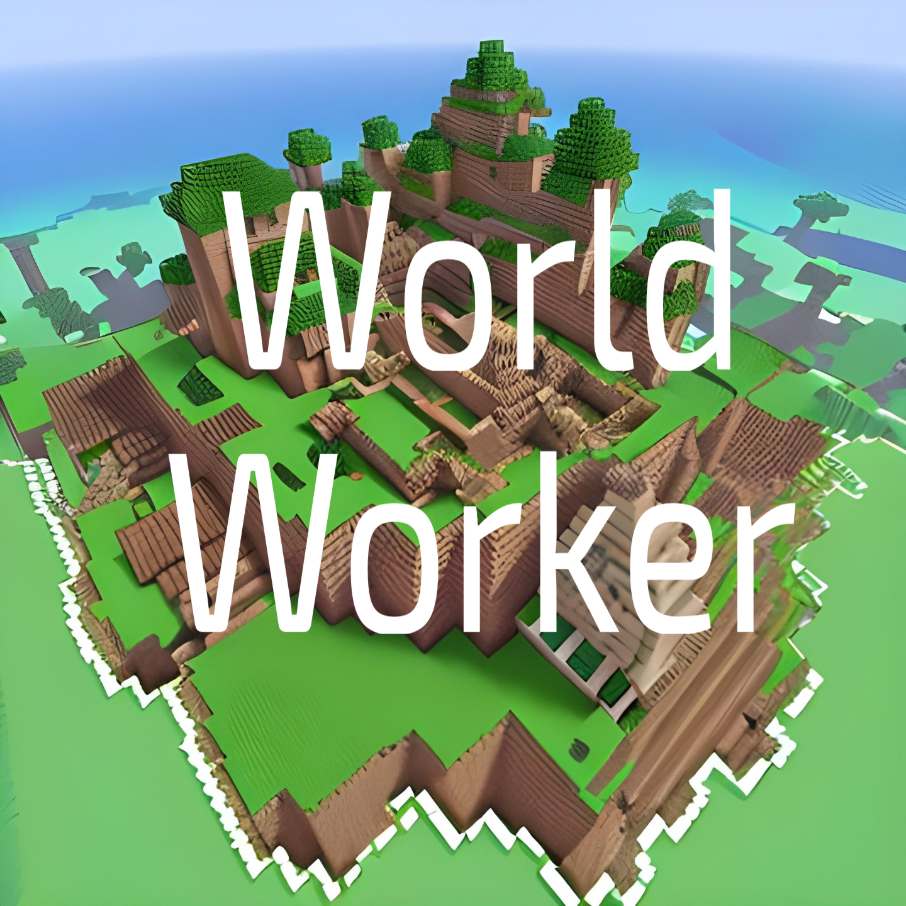
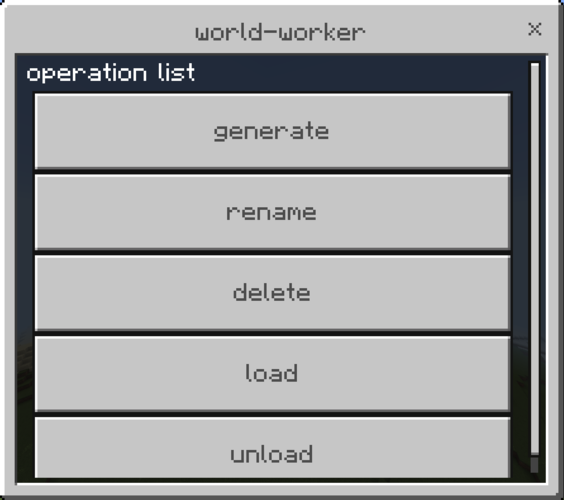
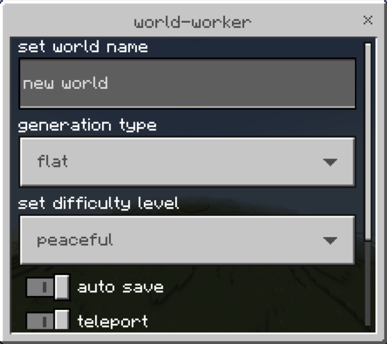
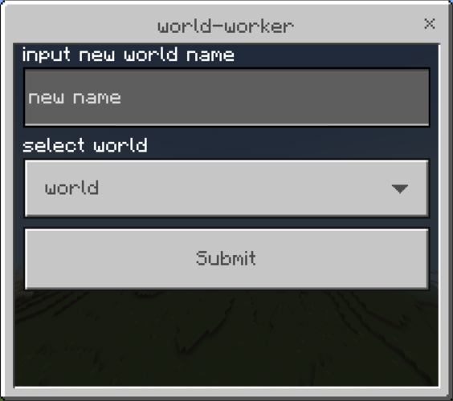

# World-Worker

**Плагин для управления мирами в PocketMine. С помощью этого плагина вы можете создавать новые миры с опциями генерации и выполнять другие операции над мирами. Для запуска плагин не требует сторонние плагины.**

**Установка:**
-
> - загрузите последний релиз.
> - поместите плагин в папку сервера `/ваш сервер/plugins/`
> - перезапустите сервер

**Список операции:**
-
- `generate` (создать мир)
- `rename` (переименовать мир)
- `delete` (удалить мир)
- `load` (загрузить мир)
- `unload` (выгрузить мир)

**Презентация:**
-

### список операции формы

### форма создания

### форма переименования

**ссылки разработчика:**
-
- [PocketMine-MP](https://github.com/pmmp/PocketMine-MP)
- [DevTools](https://github.com/pmmp/DevTools/)